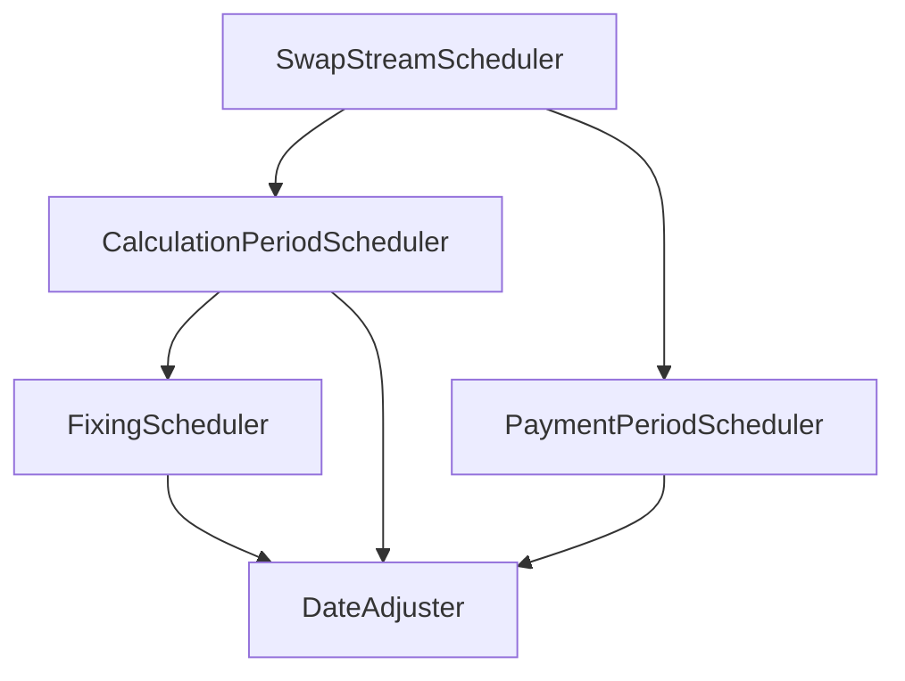

# 3. Refactor DateScheduler to Schedulers Package

## Status

Accepted

## Context

`DateScheduler` クラスの `generate_payment_periods` メソッドは、日付調整、計算スケジュールの生成、Fixing日（金利決定日）の算出、および支払期間への集約など、多くの責務を一手に引き受けており、コードが肥大化していました。
また、`DateScheduler` というクラス名は「日付の休日調整」を行うだけのイメージを与えますが、実際には「金利スワップストリーム全体の支払計算スケジュールを構築する」役割を担っており、クラス名と実体にズレが生じていました。

今後の RFR（Overnight Index）対応に伴う複利計算（Compounding）やルックバック（Lookback）などの複雑な金利決定ロジックの追加を見据え、責務を適切に分割し、拡張性と保守性を向上させる必要があります。

## Decision

1. **パッケージのリネームと整理**
   - キャッシュフロー展開（スケジュール生成）を本プロジェクトの主要サブシステムと位置づけ、`src/calculators` パッケージを `src/schedulers` へリネームします。
   - `DayCountCalculator` や `ReferenceResolver` もスケジュール生成の補助コンポーネントとして同パッケージに内包します。

2. **クラスの分割**
   - **`DateAdjuster`**: FpMLの `BusinessDayAdjustments` を解釈して単一の日付を調整する低レイヤの調整機能に特化。
   - **`SwapStreamScheduler`**: `InterestRateStream` からスケジュール全体を生成する高レイヤのオーケストレーター。
   - **`CalculationPeriodScheduler`**: 計算期間（`CalculationPeriod`）のスケジュール生成（開始日・終了日、年分率、元本適用など）。
   - **`FixingScheduler`**: 浮動金利レグのFixing日程（`FloatingRateDefinition` / `RateObservation`）の決定。
   - **`PaymentPeriodScheduler`**: 支払期間（`PaymentCalculationPeriod`）へのグループ化と集約、および支払日の休日調整。

3. **協調関係（アプローチB: 階層型コラボレーション）**
   - `SwapStreamScheduler` は `CalculationPeriodScheduler` と `PaymentPeriodScheduler` を呼び出します。
   - `CalculationPeriodScheduler` は、浮動金利レグの場合に内部で `FixingScheduler` を呼び出し、完全に構築された `CalculationPeriod` オブジェクトを返します。

## Consequences

### Positive (良い影響)
- 各クラスが単一責任原則（SRP）に従うため、個別のコンポーネント（特にFixing計算や支払日集約）のテストや機能追加が容易になります。
- 金融ドメイン（FpMLの複合型構造）とクラス構成が美しくマッピングされるため、コードの可読性が向上します。
- クラス名と実際の責務（名前のズレ）が完全に解消されます。

### Negative (懸念される影響)
- `src/calculators` から `src/schedulers` への移行に伴い、既存のインポートパスをすべて書き換える必要があります。
- ファイル数が増加するため、最初のパッケージ構造への理解が必要になります。
