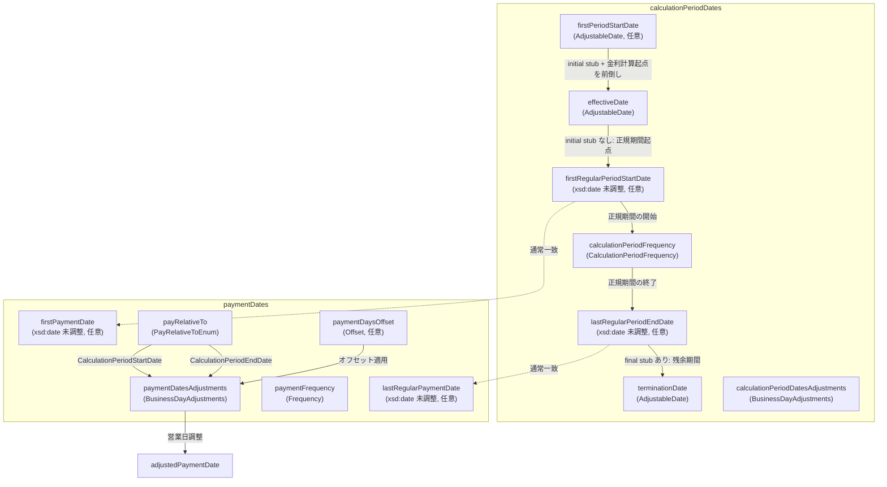
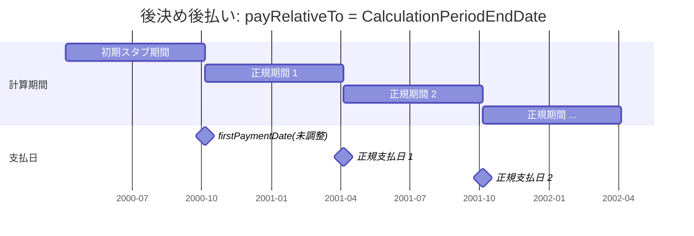
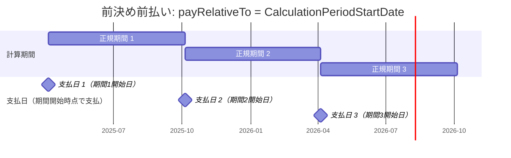
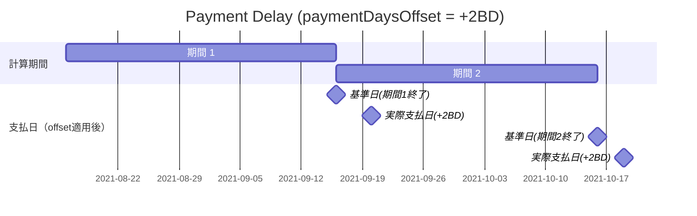
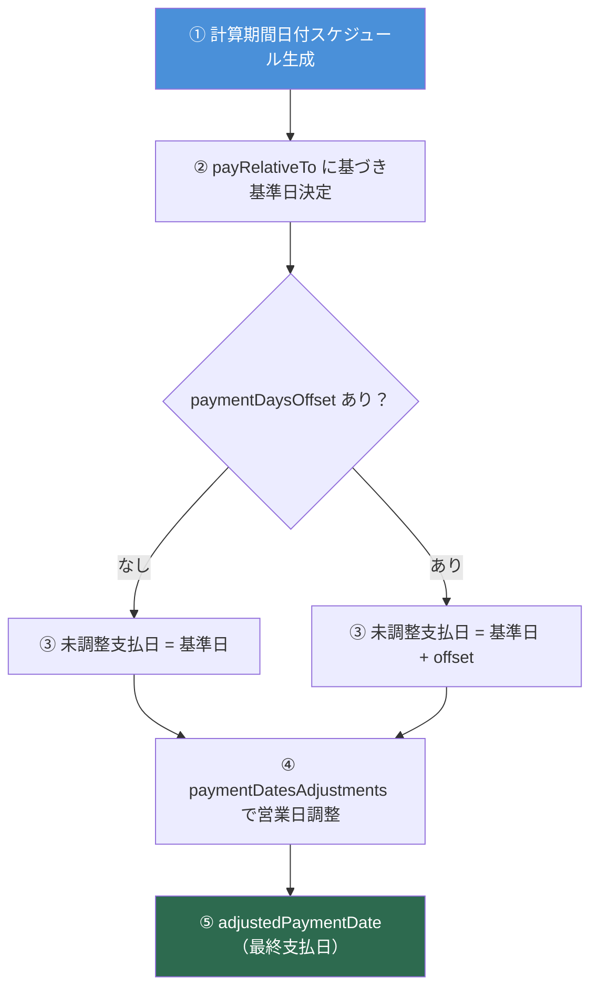
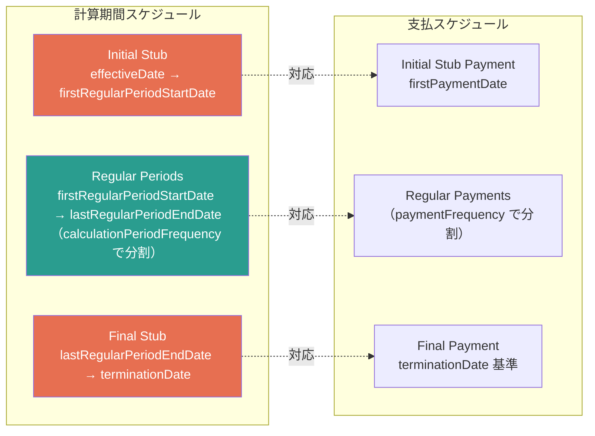

# FpML 日付要素の関係ガイド

> paymentDates と calculationPeriodDates の日付パラメータの完全解説

## 1. 日付要素の一覧表

### 1.1 calculationPeriodDates の日付要素

| 要素名 | XSD型 | 休日調整 | 役割 | 必須/任意 |
|--------|-------|---------|------|----------|
| `effectiveDate` | `AdjustableDate` | **未調整日を指定、調整ルールを内包** | 取引の開始日。計算期間スケジュールの起点 | **必須**（choice） |
| `terminationDate` | `AdjustableDate` | **未調整日を指定、調整ルールを内包** | 取引の終了日。計算期間スケジュールの終点 | **必須**（choice） |
| `firstPeriodStartDate` | `AdjustableDate` | **未調整日を指定、調整ルールを内包** | effectiveDate より前に計算期間を開始する場合の開始日 | 任意 |
| `firstRegularPeriodStartDate` | `xsd:date` | ❌ **休日調整前**（未調整日） | 正規計算期間の最初の開始日。initial stub がある場合に指定 | 任意 |
| `lastRegularPeriodEndDate` | `xsd:date` | ❌ **休日調整前**（未調整日） | 正規計算期間の最後の終了日。final stub がある場合に指定 | 任意 |

> [!IMPORTANT]
> `firstRegularPeriodStartDate` と `lastRegularPeriodEndDate` は `xsd:date` 型で定義されており、それ自体は**休日調整前の未調整日**です。実際の計算期間の境界日としては `calculationPeriodDatesAdjustments` に従って営業日調整されます。

> [!NOTE]
> `firstPeriodStartDate` は `AdjustableDate` 型で、独自の `dateAdjustments` を持ちます（通常は `NONE` で調整なし）。これは effectiveDate より前の日付を金利計算の起点として使用するためのものです。

### 1.2 paymentDates の日付要素

| 要素名 | XSD型 | 休日調整 | paymentDaysOffset | 役割 | 必須/任意 |
|--------|-------|---------|-------------------|------|----------|
| `firstPaymentDate` | `xsd:date` | ❌ **休日調整前**（未調整日） | ❌ **適用前** | 最初の未調整支払日。initial stub がある場合に指定 | 任意 |
| `lastRegularPaymentDate` | `xsd:date` | ❌ **休日調整前**（未調整日） | ❌ **適用前** | 最後の正規未調整支払日。final stub がある場合に指定 | 任意 |
| `payRelativeTo` | `PayRelativeToEnum` | - | - | 支払日が計算期間のどの日に相対するか指定 | **必須** |
| `paymentDaysOffset` | `Offset` | - | - | 基準日からの日数オフセット（支払遅延/前払い） | 任意 |
| `paymentDatesAdjustments` | `BusinessDayAdjustments` | - | - | 支払日の営業日調整ルール | **必須** |

> [!IMPORTANT]
> `firstPaymentDate` と `lastRegularPaymentDate` は共に **paymentDaysOffset 適用前** かつ **休日調整前** の「未調整支払日」です。XSD ドキュメントに以下の記載があります：
>
> *"This date will normally correspond to an unadjusted calculation period start or end date. This is true even if early or delayed payment is specified to be applicable since the actual first payment date will be the specified number of days before or after the applicable adjusted calculation period start or end date with the resulting payment date then being adjusted in accordance with any business day convention specified in paymentDatesAdjustments."*

---

## 2. 関係図

### 2.1 基本構造：calculationPeriodDates と paymentDates の関係



### 2.2 後決め後払い（In Arrears）の標準パターン



### 2.3 前決め前払い（In Advance）のパターン



### 2.4 paymentDaysOffset のあるパターン



---

## 3. 日付生成プロセスのフロー

### 3.1 支払日の生成プロセス



> [!TIP]
> `firstPaymentDate` と `lastRegularPaymentDate` は上記プロセスの **③の段階の日付**（paymentDaysOffset 適用前の未調整支払日）ではなく、**支払スケジュールの境界を定義する際の未調整計算期間日付に対応する日付**です。つまり、未調整の計算期間終了日（後払いの場合）や計算期間開始日（前払いの場合）と通常一致します。

### 3.2 スタブと日付要素の関係



---

## 4. 具体的な実例

### 4.1 実例1：後決め後払い（In Arrears） — Initial Stub + Final Stub

> 出典: [ird-ex05-long-stub-swap.xml](file:///e:/dev/python/fpml-workspace/confirmation/products/interest-rate-derivatives/ird-ex05-long-stub-swap.xml)

**取引条件:**
- 取引日: 2000-04-03
- effectiveDate: 2000-04-05
- terminationDate: 2005-01-05
- firstPeriodStartDate: 2000-03-05（金利計算起点を前倒し）
- firstRegularPeriodStartDate: 2000-10-05
- lastRegularPeriodEndDate: 2004-10-05
- calculationPeriodFrequency: 6M, rollConvention: 5
- paymentFrequency: 6M
- payRelativeTo: **CalculationPeriodEndDate**（後払い）
- paymentDaysOffset: **なし**
- firstPaymentDate: 2000-10-05

#### 計算期間スケジュールと支払日の対応

| # | 計算期間（未調整） | 種別 | 未調整支払日 | paymentDaysOffset後 | 調整済支払日 |
|---|-------------------|------|-------------|---------------------|-------------|
| 1 | 2000-04-05 → 2000-10-05 | **Initial Stub** | 2000-10-05 (`firstPaymentDate`) | - | 2000-10-05 |
| 2 | 2000-10-05 → 2001-04-05 | Regular | 2001-04-05 | - | 2001-04-05 |
| 3 | 2001-04-05 → 2001-10-05 | Regular | 2001-10-05 | - | 2001-10-05 |
| ... | ... | Regular | ... | - | ... |
| 9 | 2004-04-05 → 2004-10-05 | Regular | 2004-10-05 | - | 2004-10-05 |
| 10 | 2004-10-05 → 2005-01-05 | **Final Stub** | 2005-01-05 | - | 2005-01-05 |

**日付要素の対応関係:**

```
firstPeriodStartDate   = 2000-03-05  ← 金利計算の真の起点（effectiveDateより前）
effectiveDate          = 2000-04-05  ← 取引開始日（実際の期間開始）
firstRegularPeriodStartDate = 2000-10-05  ← Initial Stubの終了 = 正規期間の開始
firstPaymentDate            = 2000-10-05  ← firstRegularPeriodStartDateと一致
lastRegularPeriodEndDate    = 2004-10-05  ← 正規期間の最後の終了日
terminationDate             = 2005-01-05  ← Final Stub終了 = 取引終了
```

> [!NOTE]
> `firstPaymentDate = 2000-10-05` は `firstRegularPeriodStartDate` と一致しています。後払い（payRelativeTo = CalculationPeriodEndDate）の場合、Initial Stub の支払日は Initial Stub の終了日（= firstRegularPeriodStartDate）に対応します。

---

### 4.2 実例2：後決め後払い（In Arrears） — Initial Stub のみ

> 出典: [ird-ex02-stub-amort-swap.xml](file:///e:/dev/python/fpml-workspace/confirmation/products/interest-rate-derivatives/ird-ex02-stub-amort-swap.xml)

**取引条件（Floating Leg）:**
- effectiveDate: 1995-01-16
- terminationDate: 1999-12-14
- firstRegularPeriodStartDate: 1995-06-14
- lastRegularPeriodEndDate: **なし**
- calculationPeriodFrequency: 6M, rollConvention: 14
- paymentFrequency: 6M
- payRelativeTo: **CalculationPeriodEndDate**
- paymentDaysOffset: **なし**
- firstPaymentDate: 1995-06-14

#### 計算期間スケジュールと支払日の対応

| # | 計算期間（未調整） | 種別 | 未調整支払日 | 調整済支払日 |
|---|-------------------|------|-------------|-------------|
| 1 | 1995-01-16 → 1995-06-14 | **Initial Stub** | 1995-06-14 (`firstPaymentDate`) | 1995-06-14 |
| 2 | 1995-06-14 → 1995-12-14 | Regular | 1995-12-14 | 1995-12-14 |
| 3 | 1995-12-14 → 1996-06-14 | Regular | 1996-06-14 | 1996-06-14 |
| 4 | 1996-06-14 → 1996-12-14 | Regular | 1996-12-14 | **1996-12-16** (MODFOLLOWING) |
| ... | ... | ... | ... | ... |
| 10 | 1999-06-14 → 1999-12-14 | Regular | 1999-12-14 | 1999-12-14 |

**日付要素の対応関係:**

```
effectiveDate               = 1995-01-16  ← 取引開始日
firstRegularPeriodStartDate = 1995-06-14  ← Initial Stubの終了 = 正規期間の開始
firstPaymentDate            = 1995-06-14  ← firstRegularPeriodStartDateと一致
terminationDate             = 1999-12-14  ← 取引終了（Final Stubなし）
```

---

### 4.3 実例3：paymentDaysOffset ありのケース（Payment Delay +2 営業日）

> 出典: [ird-ex42-rfr-compound-swap-pmt-delay.xml](file:///e:/dev/python/fpml-workspace/confirmation/products/interest-rate-derivatives/ird-ex42-rfr-compound-swap-pmt-delay.xml)

**取引条件（Floating Leg）:**
- effectiveDate: 2021-08-16
- terminationDate: 2024-08-16
- firstRegularPeriodStartDate: **なし**（スタブなし）
- lastRegularPeriodEndDate: **なし**（スタブなし）
- calculationPeriodFrequency: 1M, rollConvention: 16
- paymentFrequency: 1M
- payRelativeTo: **CalculationPeriodEndDate**
- paymentDaysOffset: **+2 営業日（Business Days）**
- firstPaymentDate: **なし**（スタブなし）
- lastRegularPaymentDate: **なし**（スタブなし）

#### 計算期間スケジュールと支払日の対応

| # | 計算期間（未調整） | 未調整支払日(offset前) | offset適用後 | 調整済支払日 |
|---|-------------------|----------------------|-------------|-------------|
| 1 | 2021-08-16 → 2021-09-16 | 2021-09-16 | 2021-09-16 + 2BD = 2021-09-20 | 2021-09-20 |
| 2 | 2021-09-16 → 2021-10-16 | 2021-10-16 | 2021-10-16 + 2BD ≈ 2021-10-19 | 2021-10-19 |
| 3 | 2021-10-16 → 2021-11-16 | 2021-11-16 | 2021-11-16 + 2BD ≈ 2021-11-18 | 2021-11-18 |
| ... | ... | ... | ... | ... |
| 36 | 2024-07-16 → 2024-08-16 | 2024-08-16 | 2024-08-16 + 2BD ≈ 2024-08-20 | 2024-08-20 |

> [!IMPORTANT]
> **paymentDaysOffset の処理順序:**
> 1. `payRelativeTo` に基づく基準日（調整済計算期間終了日）を決定
> 2. `paymentDaysOffset` を適用して日付をずらす
> 3. `paymentDatesAdjustments` で最終的な営業日調整
>
> `firstPaymentDate`/`lastRegularPaymentDate` が指定される場合、それらは **offset 適用前の未調整支払日**（= 未調整計算期間日付に対応する日付）です。

---

### 4.4 実例4：前決め前払い（In Advance）のケース

> [!NOTE]
> ワークスペース内の FpML サンプルXML には `payRelativeTo = CalculationPeriodStartDate` を使用した前決め前払いの例が含まれていません。以下は FpML 仕様に基づく構成例です。

**想定取引条件:**
- effectiveDate: 2025-04-07
- terminationDate: 2027-04-07
- firstRegularPeriodStartDate: 2025-10-07（Initial Stub あり）
- lastRegularPeriodEndDate: **なし**
- calculationPeriodFrequency: 6M, rollConvention: 7
- paymentFrequency: 6M
- payRelativeTo: **CalculationPeriodStartDate**（前払い）
- paymentDaysOffset: **なし**
- firstPaymentDate: 2025-04-07

#### FpML XML 構成例

```xml
<paymentDates>
  <calculationPeriodDatesReference href="calcPeriodDates1"/>
  <paymentFrequency>
    <periodMultiplier>6</periodMultiplier>
    <period>M</period>
  </paymentFrequency>
  <firstPaymentDate>2025-04-07</firstPaymentDate>
  <payRelativeTo>CalculationPeriodStartDate</payRelativeTo>
  <paymentDatesAdjustments>
    <businessDayConvention>MODFOLLOWING</businessDayConvention>
    <businessCenters>
      <businessCenter>JPTO</businessCenter>
    </businessCenters>
  </paymentDatesAdjustments>
</paymentDates>
```

#### 計算期間スケジュールと支払日の対応

| # | 計算期間（未調整） | 種別 | 未調整支払日 | 調整済支払日 |
|---|-------------------|------|-------------|-------------|
| 1 | 2025-04-07 → 2025-10-07 | **Initial Stub** | 2025-04-07 (`firstPaymentDate`, 期間**開始日**) | 2025-04-07 |
| 2 | 2025-10-07 → 2026-04-07 | Regular | 2025-10-07（期間開始日） | 2025-10-07 |
| 3 | 2026-04-07 → 2026-10-07 | Regular | 2026-04-07（期間開始日） | 2026-04-07 |
| 4 | 2026-10-07 → 2027-04-07 | Regular | 2026-10-07（期間開始日） | 2026-10-07 |

> [!WARNING]
> 前決め前払いでは、支払日が計算期間の**開始日**に対応します。つまり、金利が確定する**前**に支払が行われるパターンです。これは固定金利レグでは合理的ですが、変動金利レグでは「前決め」金利（期初にリセットした金利を使用して期初に支払う）という特殊なケースになります。

---

### 4.5 実例5：前決め前払い + paymentDaysOffset のケース

**想定取引条件:**
- effectiveDate: 2025-04-07
- terminationDate: 2026-04-07
- calculationPeriodFrequency: 3M, rollConvention: 7
- paymentFrequency: 3M
- payRelativeTo: **CalculationPeriodStartDate**（前払い）
- paymentDaysOffset: **-2 営業日（早期支払、periodMultiplier = -2）**

#### FpML XML 構成例

```xml
<paymentDates>
  <calculationPeriodDatesReference href="calcPeriodDates1"/>
  <paymentFrequency>
    <periodMultiplier>3</periodMultiplier>
    <period>M</period>
  </paymentFrequency>
  <payRelativeTo>CalculationPeriodStartDate</payRelativeTo>
  <paymentDaysOffset>
    <periodMultiplier>-2</periodMultiplier>
    <period>D</period>
    <dayType>Business</dayType>
  </paymentDaysOffset>
  <paymentDatesAdjustments>
    <businessDayConvention>MODFOLLOWING</businessDayConvention>
    <businessCenters>
      <businessCenter>JPTO</businessCenter>
    </businessCenters>
  </paymentDatesAdjustments>
</paymentDates>
```

#### 計算期間スケジュールと支払日の対応

| # | 計算期間（未調整） | 基準日(payRelativeTo) | offset適用後(-2BD) | 調整済支払日 |
|---|-------------------|-----------------------|-------------------|-------------|
| 1 | 2025-04-07 → 2025-07-07 | 2025-04-07 | 2025-04-03 | 2025-04-03 |
| 2 | 2025-07-07 → 2025-10-07 | 2025-07-07 | 2025-07-03 | 2025-07-03 |
| 3 | 2025-10-07 → 2026-01-07 | 2025-10-07 | 2025-10-03 | 2025-10-03 |
| 4 | 2026-01-07 → 2026-04-07 | 2026-01-07 | 2026-01-05 | 2026-01-05（月曜） |

> [!NOTE]
> `paymentDaysOffset` の `periodMultiplier` が**負の値**の場合は「早期支払」を意味し、支払日が基準日より**前**にずれます。正の値は「遅延支払（Payment Delay）」です。

---

## 5. まとめ：日付の対応関係

### 5.1 後決め後払い（payRelativeTo = CalculationPeriodEndDate）

```
calculationPeriodDates         paymentDates

effectiveDate ──────────────── (支払スケジュールの計算期間起点)
       │
       │ Initial Stub
       │
firstRegularPeriodStartDate ── firstPaymentDate  ← 通常一致
       │
       │ Regular Periods
       │ (calculationPeriodFrequency)
       │
lastRegularPeriodEndDate ───── lastRegularPaymentDate  ← 通常一致
       │
       │ Final Stub
       │
terminationDate ────────────── 最終支払日（暗黙的）
```

### 5.2 前決め前払い（payRelativeTo = CalculationPeriodStartDate）

```
calculationPeriodDates         paymentDates

effectiveDate ──────────────── firstPaymentDate  ← 期間開始日に支払
       │
       │ Initial Stub
       │
firstRegularPeriodStartDate ── 正規支払日 1（期間開始時に支払）
       │
       │ Regular Periods
       │
lastRegularPeriodEndDate ───── (最終正規期間の開始日が lastRegularPaymentDate に対応)
       │
       │ Final Stub
       │
terminationDate ────────────── (Final Stub 開始日が最終支払基準日)
```

### 5.3 paymentDaysOffset の影響

```
基準日(payRelativeTo による)
  ↓
  ├── paymentDaysOffset 適用（+N日 or -N日）
  │     ↓
  │   オフセット適用後の日付
  │     ↓
  │   paymentDatesAdjustments で営業日調整
  │     ↓
  │   adjustedPaymentDate（最終支払日）
  │
  └── firstPaymentDate / lastRegularPaymentDate は
      この基準日（オフセット適用前・営業日調整前）に対応
```

---

## 6. XSD 根拠

### calculationPeriodDates の定義

> [fpml-ird-5-12.xsd](file:///e:/dev/python/fpml-workspace/confirmation/fpml-ird-5-12.xsd#L181-L247)
>
> *"A calculation period schedule consists of an optional initial stub calculation period, one or more regular calculation periods and an optional final stub calculation period. In the absence of any initial or final stub calculation periods, the regular part of the calculation period schedule is assumed to be between the effective date and the termination date. No implicit stubs are allowed, i.e. stubs must be explicitly specified using an appropriate combination of firstPeriodStartDate, firstRegularPeriodStartDate and lastRegularPeriodEndDate."*

### firstPaymentDate の定義

> [fpml-ird-5-12.xsd](file:///e:/dev/python/fpml-workspace/confirmation/fpml-ird-5-12.xsd#L1421-L1425)
>
> *"The first **unadjusted** payment date. This day may be subject to adjustment in accordance with any business day convention specified in paymentDatesAdjustments. This element must only be included if there is an initial stub. This date will normally correspond to an unadjusted calculation period start or end date. This is true even if early or delayed payment is specified to be applicable..."*

### lastRegularPaymentDate の定義

> [fpml-ird-5-12.xsd](file:///e:/dev/python/fpml-workspace/confirmation/fpml-ird-5-12.xsd#L1426-L1430)
>
> *"The last regular **unadjusted** payment date. This day may be subject to adjustment in accordance with any business day convention specified in paymentDatesAdjustments. This element must only be included if there is a final stub. All calculation periods after this date contribute to the final payment."*

### paymentDaysOffset の定義

> [fpml-ird-5-12.xsd](file:///e:/dev/python/fpml-workspace/confirmation/fpml-ird-5-12.xsd#L1436-L1440)
>
> *"If early payment or delayed payment is required, specifies the number of days offset that the payment occurs relative to what would otherwise be the unadjusted payment date. [...] An early payment would be indicated by a negative periodMultiplier element value and a delayed payment (or payment lag) would be indicated by a positive periodMultiplier element value."*
