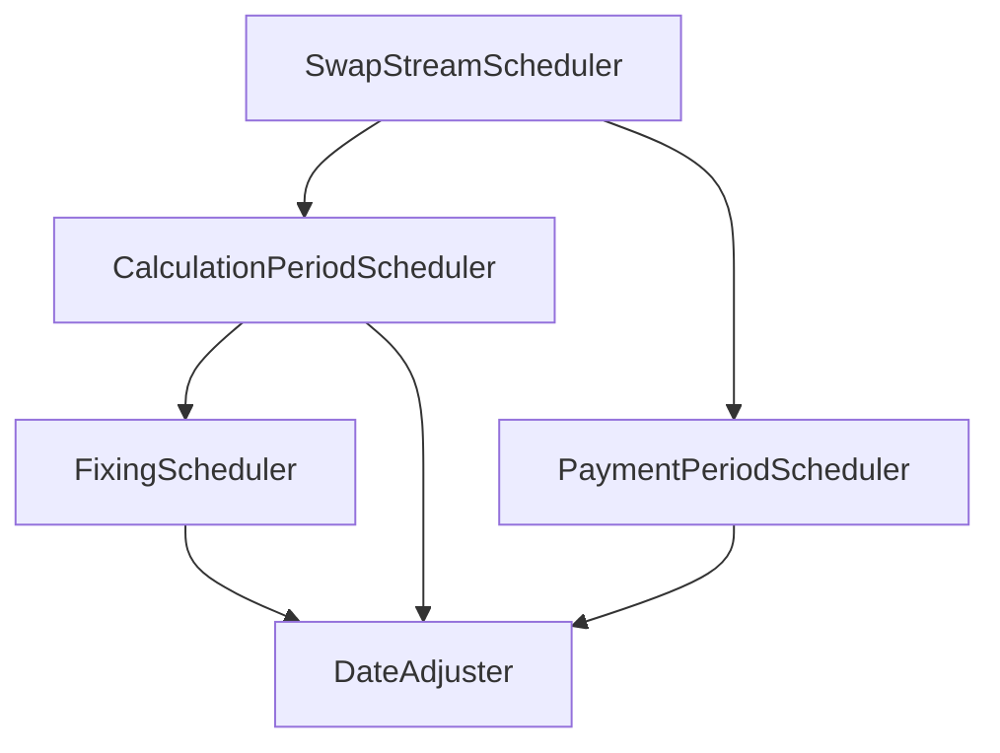

# Handoff Document: キャッシュフロー展開ツールの TDD 実装

## 次のセッションの目標
- `e:\dev\python\fpml-workspace\PRD_CASHFLOW_EXPANSION.md`の要件を分割して GitHub に登録した Issue #9 から #15 のうち、次は **Issue #12** を **TDD (テスト駆動開発) アプローチで実装** する。

---

### クラス構造と役割
FpMLのドメイン概念（計算期間、決定日、支払期間）に対応する形で、以下のクラス階層（階層型コラボレーション）を構築しています。

- **`DateAdjuster`**: FpMLの `BusinessDayAdjustments` を用いた単一の日付の休日調整（`adjust_date`）に特化。
- **`FixingScheduler`**: 浮動金利レグのFixing日程（`FloatingRateDefinition` / `RateObservation`）の決定。
- **`CalculationPeriodScheduler`**: 計算期間（`CalculationPeriod`）の日程決定および想定元本・金利情報の付与（内部で `FixingScheduler` を呼び出す）。
- **`PaymentPeriodScheduler`**: 計算期間をグループ化し、支払期間（`PaymentCalculationPeriod`）に集約・支払日の休日調整を行う。
- **`SwapStreamScheduler`**: `InterestRateStream` を受け取って上記をオーケストレートするメインエントリポイント。

---

## Issue #12 に向けた実装方針のヒント

Issue #12 では、**元本交換（Principal Exchange）のスケジュール生成** および **クロスカレンシースワップ（異なる2通貨のストリーム対応）** が対象です。

1. **元本交換（Principal Exchange）の日付決定**:
   - 初期（Initial）、最終（Final）、中間（Intermediate）の元本交換が発生する日付（通常は実効日や終了日など）の算出において、休日調整が必要となります。低レイヤの日付調整機能を持つ `DateAdjuster` を再利用して日付決定を行うのが適切です。
2. **複数ストリーム（レグ）の処理**:
   - クロスカレンシースワップでは固定/浮動だけでなく、通貨の異なるレグを扱います。現在の `SwapStreamScheduler` は単一の `InterestRateStream` から支払計算期間（`PaymentCalculationPeriod`）を生成するようきれいに独立しているため、レグごとにインスタンス化（あるいは呼び出し）してマージする上位の制御が容易に行えます。

---

## 関連リソース
- **PRD**: [PRD_CASHFLOW_EXPANSION.md](file:///e:/dev/python/fpml-workspace/PRD_CASHFLOW_EXPANSION.md)
- **ADR**: [0003-refactor-date-scheduler-to-schedulers.md](file:///e:/dev/python/fpml-workspace/docs/adr/0003-refactor-date-scheduler-to-schedulers.md)
- **検証済みテスト**: [test_swap_stream_scheduler.py](file:///e:/dev/python/fpml-workspace/tests/schedulers/test_swap_stream_scheduler.py) などの `tests/schedulers/` 配下のテスト群。

---

## 提案されるスキル (Suggested Skills)
- **`tdd`**: Issue #12 の実装を進めるメインの Red-Green-Refactor 開発サイクル。
- **`git-auto-closer`**: 実装完了後、コミット・プッシュ・GitHub Issue のクローズを一括で行う。
